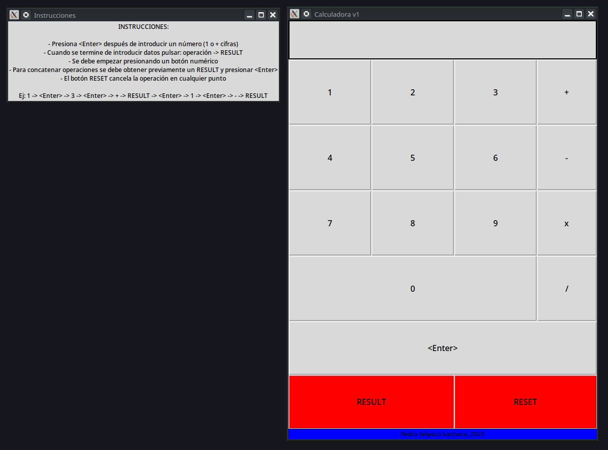

# Learning_Python

## El por qué de este repo  

Me he propuesto aprender durante una hora al día varios lenguajes de programación de los cuales no tengo conocimiento, empezando desde 0. Entre los lenguajes seleccionados se encuentra Python, un lenguaje que siempre me ha atraído por su sencillez, versatilidad y la cantidad de proyector que se pueden hacer sin tener un vasto conocimiento del lenguaje.

## Timeline de avances

- Lunes 20 de Mayo: primer día aprendiendo python, he hecho tres programas muy sencillos para aprender la sintaxis básica, manejo de variables, condicionales y bucles y la estructura de datos set.
- Martes 21 de Mayo: he añadido un nuevo programa que usa funciones para filtrar los números primos de una lista ingresada por el usuario.
- Miércoles 22 de Mayo: viciada padre, completadas las primeras dos versiones del proyecto del nivel 0. Estoy orgulloso por un lado, pero por el otro no debería invertir tantas horas teniendo otras cosas que hacer.  
- Lunes 27 de Mayo: empezando con el nivel 1, he empezado con excepciones, viendo como funciona el bloque try - except y la instrucción raise. Posteriormente veré la creación de errores propios mediante clases.
- Martes 28 de Mayo: he aprendido a crear y manejar excepciones personalizadas simples, intentaré implementarlas más en futuros códigos. También he comenzado a aprender sobre las funciones lambda para funciones simple que se repitan muchas veces en un programa

## Directorio de ficheros

Primero que nada, la documentación de Python se puede consultar aquí: ([Documentación](https://docs.python.org/3/)).  

Cada nivel se compone de forma arbitraria de programas de creciente dificultad comentados en los que se aprende algo nuevo. También, cada uno de ellos incluirá un pequeño proyecto final.

- [nivel_0](nivel_0): sintaxis básica, variables, condicionales, bucles y estructuras de datos simples.
    - [`hello.py`](nivel_0/hello.py): hola mundo.
    - [`first_script.py`](nivel_0/first_script.py): programa simple en el que el usuario introduce su nombre y edad y el programa le devuelve esta información. Se controla que los datos sean correctos, o por lo menos coherentes.  
    - [`control_structures.py`](nivel_0/control_sctructures.py): programa en el que el usuario introduce nombres en un `set`, una ED que no permite valores repetidos. Posteriormente, mediante condicionales, el usuario puede buscar un nombre en este conjunto y comprobar si el nombre está presente.
    - [`functions.py`](nivel_0/functions.py): pequeño script para filtrar los números primos de una lista ingresada por el usuario. Para ello se usan dos funciones "es_primo", que determina si un número es primo y "devuelve_primo" que devuelve el conjunto filtrado. Se ha aprendido aparte a usar operadores ternarios, la función range() y la convención de usar "_" para variables que no deben ser modificadas.
    - [Proyecto: Calculadora simple](nivel_0/Calculadora_Simple): el proyecto final del nivel 0. Una calculadora que permita hacer operaciones de dos o más operandos y que use una GUI sencilla e intuitiva.  
        - [`calculadora_V0`](nivel_0/Calculadora_Simple/calculadora_V0.py): versión funcional de la calculadora en terminal. Usa varias funciones, estructuras de control de argumentos y una lista para almacenar los operandos.
        - [`calculadora_V1`](nivel_0/Calculadora_Simple/calculadora_V1.py): versión que implementa la primera versión con interfaz de la calculadora. Al ejecutar se abren dos ventanas, una contiene las instrucciones y la otra el programa en sí. Para la GUI se usa Tkinter, bastante fácil e intuitivo de usar a un nivel básico. Me ha costado aproximadamente unas dos horas en pillarle el truco totalmente a este framework. Considero que lo más complicado es recoger información a partir de eventos (botones en este caso). Este proceso está explicado en el propio archivo.  
            
            Aspectos a mejorar para la siguiente (y última) versión:  
            - Controlar las divisiones / 0.  
            - Que se ingrese una cadena de operaciones, actualmente el proceso es lento.  

            Se adjuntan unas imágenes de la GUI:  

            

- [nivel_1](nivel_1): manejo de excepciones, lamda y map, trabajar con archivos etc.  
        - [`excepciones_0.py`](nivel_1/excepciones_0.py): sintaxis básica del bloque try - except.  
        - [`excepciones_1.py`](nivel_1/excepciones_1.py): manejo de una excepción de tipo usando un bucle infinito y break (en vd con esto te escuecen un poco los ojos).  
        - [`excepciones_2.py`](nivel_1/excepciones_2.py): uso se la instrucción raise para lanzar una excepción con un mensaje personalizado.  
        - [`excepciones_3.py`](nivel_1/excepciones_3.py): mediante una clase que hereda de Exception, se crea una excepción personalizada que se lanza si el valor introducido es incorrecto, esto se evalua mediante una función.  
        - [`lambda_function_0.py`](nivel_1/lambda_function_0.py): programa que usa una función lambda para elevar una base a un exponente. Son funciones que se escriben en una línea y ayudan a hacer el código más corto y legible
